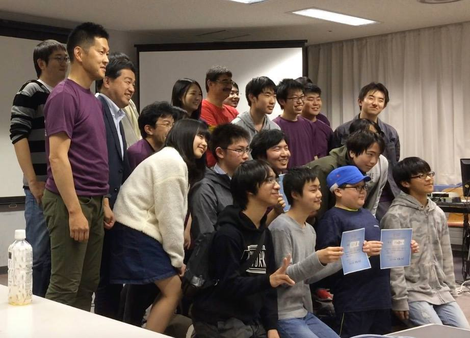

第６回目は、前回の優勝・準優勝者、初参加２名、釧路高専５名の計９名で熱戦が繰り広げられました。
参加者や親御さんたち、協賛くださった方々、応援してくれた方々に、実行委員一同たいへん感謝しております。

プロコンの性質上、競技開始後は戦況を見守るしかないのですが、それをじっと見つめる出場者や観覧者の思いが画面上を動き回るキャラクターに何かしら伝わっているんじゃないかと思えるようなドラマが今年も幾度となく見られました。

今回は上位３位(全道大会への出場権獲得)を初参加者が占めましたが、来年以降もチャンスの残っている人がまだたくさんいます。
全道大会(11/3 に旭川にて)も楽しみです！
