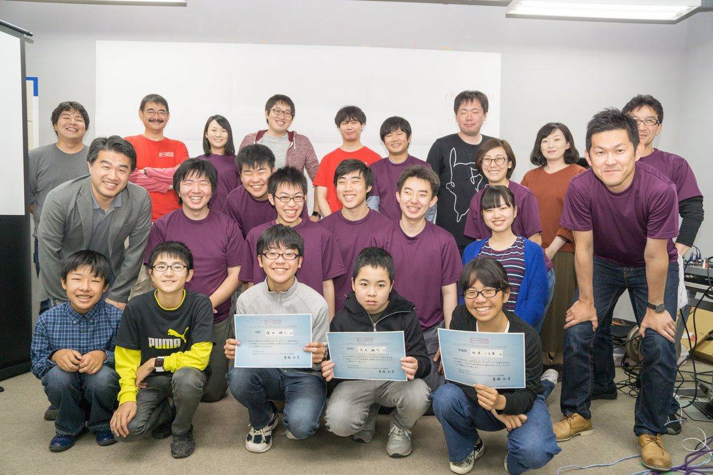

U-16 釧路プログラミングコンテストは，釧路市またはその近郊に住む 16 歳以下の中高生を対象にしたプログラミングコンテストとなっています。釧路大会（釧路プロコン）は、2012 年にスタートし、今年で 6 回目を迎えます。

釧路工業高等専門学校のプログラミング研究会とタッグを組み、プログラミングの指導は現役の高専生が担当しています。プログラミング、と聞くと少し難しく感じるかもしれませんが、この釧路プロコンでは講習会を開催し、大会当日までにはほとんどの人がゲーム（CHaser と呼ばれる対戦型ゲーム）プログラミングを身に付けることができます。

そのゲームを見るだけでも盛り上がります！

ご興味が湧いた方は、ぜひお気軽に説明会へご参加ください！！
