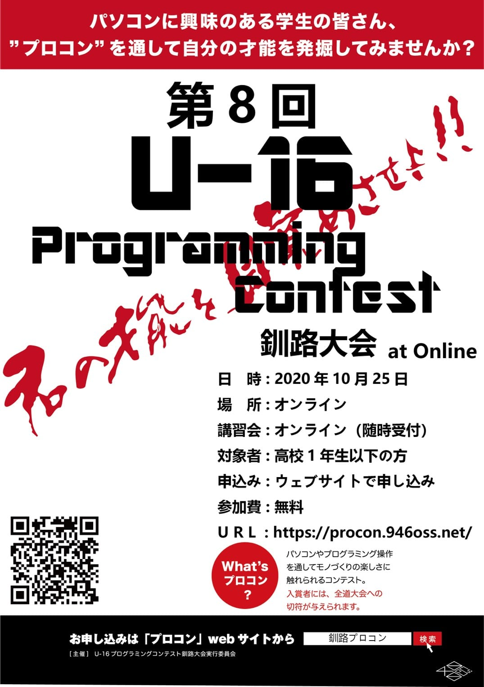

これまで 7 回開催してきた釧路でのプログラミングコンテストを、今年は新型コロナウイルス対策を踏まえてオンラインで開催することが決定しました！

U-16 プログラミングコンテストとは、16 歳（高校 1 年生）以下を対象にしたプログラミングコンテストです。

プログラミングってよくわからない、という方でも講習会でレベルに合わせて講師が指導しますので、未経験者も大歓迎！

興味があって釧路管内の高校 1 年生以下であればどなたでもご参加いただけます！過去には小学校高学年の参加者もいましたよ ✨

**《第 8 回 U-16 プログラミングコンテスト 釧路大会　開催概要》**

- 開催日時：2020/10/25 13:00 ～(予定)
- 開催場所：オンライン開催 (YouTube Live で観戦できる予定です)
- 参加費：無料
- 対象：釧路管内、近郊にお住まいの 2021 年 4 月 1 日時点で 16 歳以下となる方
- 大会公式サイト https://procon.946oss.net/
- Facebook ページ https://www.facebook.com/u16.kushiro.procon/

そして、8/31（月）から個別にオンライン講習会もスタートします。申し込みすると YouTube の説明動画が見られるので、まずはそちらをご視聴いただいた上で、チャットで講師とコミュニケーションを取ったり質問したりできます。

まずはオンライン講習会の動画や実際の作業でイメージを掴んで、その上でやってみられそうだったら大会に参加、という感じでも全く問題ありませんので、少しでもご興味お持ちいただけたらぜひお申し込みください！

なかなか外にも出づらいこの機会。プログラミングを始めてみると、お子さんの新しい才能が花開くかもしれませんよ ♪

また、家庭にプログラミングできる環境がない方向けのオフライン講習会も 9 月中目処に開催を予定しています。そちらもお気軽にお問い合わせください。

たくさんのご参加、お待ちしております！
