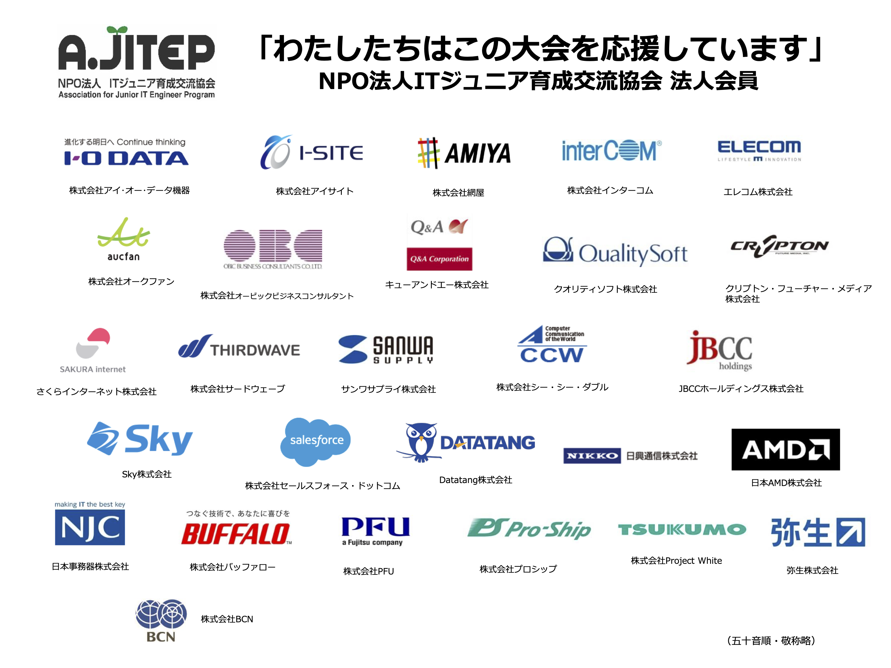

第８回大会は、参加者６名で開催されました。
当日は、新型コロナウイルス感染症の対策のため、参加者はオンラインでの参加、観戦のため YouTube Live を行いました。

当日の様子は YouTube Live のアーカイブからご覧になれます。
https://youtu.be/BGRSf01e6Iw?t=541

11/3 に行われる[北海道大会](http://www.procon-asahikawa.org/)へ参加する権利を得たのは以下の４名です。おめでとうございます。
なお、今大会はオンライン配信を行う関係上、希望者はハンドルネームでの公開となっております。

- magnet
- aoi
- error
- masato

北海道大会での活躍も期待しております！

### 2020 第 8 回 U-16 プログラミングコンテスト釧路大会

#### 主催

- U-16 プログラミングコンテスト釧路大会実行委員会

#### 協賛

- （株）山一佐藤紙店 https://satokamiten.hp.gogo.jp/
- （株）プライムネス
- （株）オイコス https://oikos.vision/
- 濱野販促企画（株）
- トーワ計装（株） http://www.towatec.co.jp/wp/

#### 後援

- 釧路市教育委員会
- NPO 法人　 IT ジュニア育成交流協会
- 釧路 IT クラスター推進協会
