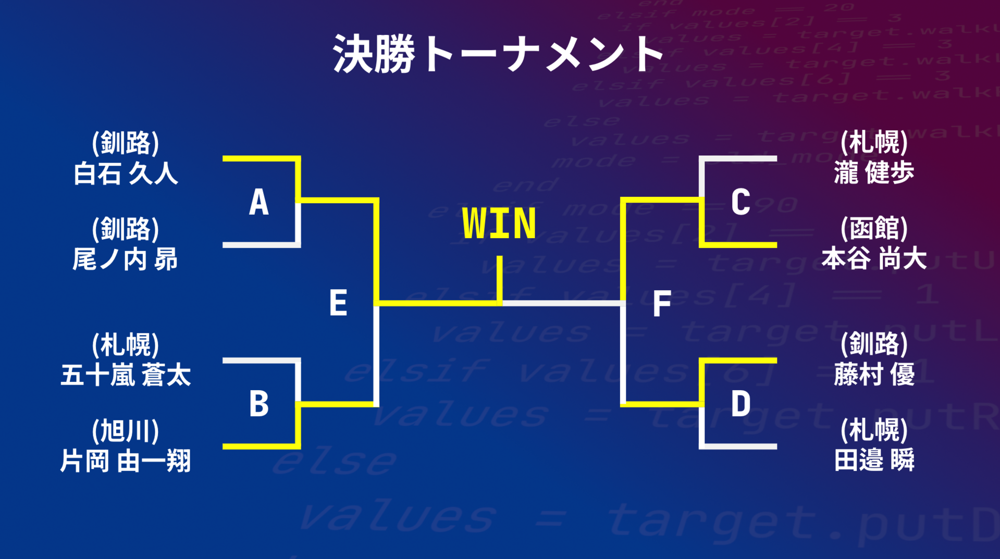

第11回U-16プログラミングコンテスト北海道大会におけるすべての試合結果を公表いたします．

リプレイ映像は，下記リンクから閲覧できます．
https://drive.google.com/drive/folders/1vt-x1u93__hmQUE_TAbIqjnZlov9kl6Q?usp=drive_link

## 予選

### ハートリーグ
| 試合順番 | 対戦相手(COOL)    | 対戦相手(HOT)     | ポイント(COOL-HOT) | 勝敗 | 理由         | 
| -------- | ----------------- | ----------------- | ------------------ | ---- | ------------ | 
| 1-前半   | (釧路)藤村 優     | (旭川)加藤 瑠規   | 7-14               | COOL | HOT自滅      | 
| 1-後半   | (旭川)加藤 瑠規   | (釧路)藤村 優     | 8-0                | HOT  | COOL自滅     | 
| 2-前半   | (札幌)五十嵐 蒼太 | (函館)葛西 凰介   | 1-9                | COOL | HOT自滅      | 
| 2-後半   | (函館)葛西 凰介   | (札幌)五十嵐 蒼太 | 9-2                | HOT  | COOL自滅     | 
| 3-前半   | (函館)葛西 凰介   | (旭川)加藤 瑠規   |                    | DRAW |              | 
| 3-後半   | (旭川)加藤 瑠規   | (函館)葛西 凰介   |                    | DRAW |              | 
| 4-前半   | (札幌)五十嵐 蒼太 | (釧路)藤村 優     | 12-4               | HOT  | COOL自滅     | 
| 4-後半   | (釧路)藤村 優     | (札幌)五十嵐 蒼太 | 0-16               | COOL | PUT勝ち      | 
| 5-前半   | (旭川)加藤 瑠規   | (札幌)五十嵐 蒼太 | 5-2                | COOL | HOT自滅      | 
| 5-後半   | (札幌)五十嵐 蒼太 | (旭川)加藤 瑠規   | 16-3               | HOT  | COOL自滅     | 
| 6-前半   | (釧路)藤村 優     | (函館)葛西 凰介   | 9-16               | COOL | PUT勝ち      | 
| 6-後半   | (函館)葛西 凰介   | (釧路)藤村 優     | 10-12              | HOT  | アイテム勝ち | 

 

|順位|選手名|総獲得ポイント数|アイテム勝ち|PUT勝ち|相手自滅による勝ち|試合勝利数|
|---|---|---|---|---|---|---|
|1|(釧路)藤村 優|32|1|2|3|2|
|2|(札幌)五十嵐 蒼太|49|0|0|2|1|
|3|(旭川)加藤 瑠規|30|0|0|2|1|
|4|(函館)葛西 凰介|44|0|0|0|1|

### クローバーリーグ
| 試合順番 | 対戦相手(COOL)    | 対戦相手(HOT)     | ポイント(COOL-HOT) | 勝敗 | 理由         | 
| -------- | ----------------- | ----------------- | ------------------ | ---- | ------------ | 
| 1-前半   | (旭川)片岡 由一翔 | (釧路)神田 昂一郎 | 15-3               | COOL | HOT自滅      | 
| 1-後半   | (釧路)神田 昂一郎 | (旭川)片岡 由一翔 | 11-5               | COOL | HOT自滅      | 
| 2-前半   | (函館)本谷 尚大   | (札幌)橘 郁海     | 22-5               | COOL | PUT勝ち      | 
| 2-後半   | (札幌)橘 郁海     | (函館)本谷 尚大   | 3-10               | HOT  | PUT勝ち      | 
| 3-前半   | (札幌)橘 郁海     | (釧路)神田 昂一郎 | 14-6               | COOL | アイテム勝ち | 
| 3-後半   | (釧路)神田 昂一郎 | (札幌)橘 郁海     | 7-3                | HOT  | COOL自滅     | 
| 4-前半   | (函館)本谷 尚大   | (旭川)片岡 由一翔 | 11-8               | COOL | アイテム勝ち | 
| 4-後半   | (旭川)片岡 由一翔 | (函館)本谷 尚大   | 7-10               | HOT  | アイテム勝ち | 
| 5-前半   | (釧路)神田 昂一郎 | (函館)本谷 尚大   | 22-3               | COOL | アイテム勝ち | 
| 5-後半   | (函館)本谷 尚大   | (釧路)神田 昂一郎 | 12-29              | HOT  | アイテム勝ち | 
| 6-前半   | (旭川)片岡 由一翔 | (札幌)橘 郁海     | 6-10               | HOT  | アイテム勝ち | 
| 6-後半   | (札幌)橘 郁海     | (旭川)片岡 由一翔 | 8-18               | HOT  | アイテム勝ち | 

 

|順位|選手名|総獲得ポイント数|アイテム勝ち|PUT勝ち|相手自滅による勝ち|試合勝利数|
|---|---|---|---|---|---|---|
|1|(旭川)片岡 由一翔|59|1|0|1|2|
|2|(函館)本谷 尚大|68|2|2|0|2|
|3|(釧路)神田 昂一郎|78|2|0|1|1|
|4|(札幌)橘 郁海|43|2|0|1|1|

### スペードリーグ
| 試合順番 | 対戦相手(COOL)    | 対戦相手(HOT)     | ポイント(COOL-HOT) | 勝敗 | 理由         | 
| -------- | ----------------- | ----------------- | ------------------ | ---- | ------------ | 
| 1-前半   | (札幌)瀧 健歩     | (函館)わ | 5-4                | COOL | アイテム勝ち | 
| 1-後半   | (函館)わ | (札幌)瀧 健歩     | 5-4                | HOT  | COOL自滅     | 
| 2-前半   | (旭川)戸田 優生   | (釧路)白石 久人   | 16-14              | HOT  | PUT勝ち      | 
| 2-後半   | (釧路)白石 久人   | (旭川)戸田 優生   | 0-15               | HOT  | アイテム勝ち | 
| 3-前半   | (釧路)白石 久人   | (函館)わ | 3-13               | COOL | PUT勝ち      | 
| 3-後半   | (函館)わ | (釧路)白石 久人   | 18-0               | COOL | アイテム勝ち | 
| 4-前半   | (旭川)戸田 優生   | (札幌)瀧 健歩     | 12-15              | HOT  | アイテム勝ち | 
| 4-後半   | (札幌)瀧 健歩     | (旭川)戸田 優生   | 1-4                | HOT  | PUT勝ち      | 
| 5-前半   | (函館)わ | (旭川)戸田 優生   | 84-4               | COOL | アイテム勝ち | 
| 5-後半   | (旭川)戸田 優生   | (函館)わ | 50-39              | COOL | アイテム勝ち | 
| 6-前半   | (札幌)瀧 健歩     | (釧路)白石 久人   | 9-9                | DRAW |              | 
| 6-後半   | (釧路)白石 久人   | (札幌)瀧 健歩     | 5-11               | HOT  | アイテム勝ち | 

 

|順位|選手名|総獲得ポイント数|アイテム勝ち|PUT勝ち|相手自滅による勝ち|試合勝利数|
|---|---|---|---|---|---|---|
|1|(札幌)瀧 健歩|45|3|0|1|2|
|2|(釧路)白石 久人|31|0|2|0|2|
|3|(旭川)戸田 優生|101|2|1|0|1|
|4|(函館)わ|163|2|0|0|1|

### ダイヤリーグ
| 試合順番 | 対戦相手(COOL)    | 対戦相手(HOT)     | ポイント(COOL-HOT) | 勝敗 | 理由         | 
| -------- | ----------------- | ----------------- | ------------------ | ---- | ------------ | 
| 1-前半   | (函館)宮本 蒼     | (札幌)田邉 瞬     | 19-15              | HOT  | PUT勝ち      | 
| 1-後半   | (札幌)田邉 瞬     | (函館)宮本 蒼     | 9-15               | HOT  | アイテム勝ち | 
| 2-前半   | (釧路)尾ノ内 昴   | (旭川)多羽田 理史 | 0-1                | COOL | HOT自滅      | 
| 2-後半   | (旭川)多羽田 理史 | (釧路)尾ノ内 昴   | 0-0                | HOT  | COOL自滅     | 
| 3-前半   | (旭川)多羽田 理史 | (札幌)田邉 瞬     | 0-0                | HOT  | COOL自滅     | 
| 3-後半   | (札幌)田邉 瞬     | (旭川)多羽田 理史 | 1-17               | COOL | HOT自滅      | 
| 4-前半   | (釧路)尾ノ内 昴   | (函館)宮本 蒼     | 3-10               | HOT  | COOL自滅     | 
| 4-後半   | (函館)宮本 蒼     | (釧路)尾ノ内 昴   | 2-0                | HOT  | COOL自滅     | 
| 5-前半   | (札幌)田邉 瞬     | (釧路)尾ノ内 昴   | 9-0                | HOT  | COOL自滅     | 
| 5-後半   | (釧路)尾ノ内 昴   | (札幌)田邉 瞬     | 3-10               | HOT  | COOL自滅     | 
| 6-前半   | (函館)宮本 蒼     | (旭川)多羽田 理史 | 3-14               | HOT  | COOL自滅     | 
| 6-後半   | (旭川)多羽田 理史 | (函館)宮本 蒼     | 3-1                | HOT  | PUT勝ち      | 

 

|順位|選手名|総獲得ポイント数|アイテム勝ち|PUT勝ち|相手自滅による勝ち|試合勝利数|
|---|---|---|---|---|---|---|
|1|(釧路)尾ノ内 昴|11|0|0|4|2|
|2|(札幌)田邉 瞬|44|1|1|2|2|
|3|(函館)宮本 蒼|50|1|1|1|1|
|4|(旭川)多羽田 理史|35|0|0|1|1|

## 本戦

試合順番のグループは上記のとおりです．3位決定戦は，グループEとグループFの敗者同士で競います．

| 試合順番        | 対戦相手(COOL)    | 対戦相手(HOT)     | ポイント(COOL-HOT) | 勝敗 | 理由         | 
| --------------- | ----------------- | ----------------- | ------------------ | ---- | ------------ | 
| A-前半          | (釧路)白石 久人   | (釧路)尾ノ内 昴   | 2-0                | COOL | アイテム勝ち | 
| A-後半          | (釧路)尾ノ内 昴   | (釧路)白石 久人   | 6-8                | HOT  | アイテム勝ち | 
| B-前半          | (札幌)五十嵐 蒼太 | (旭川)片岡 由一翔 | 8-9                | HOT  | PUT勝ち      | 
| B-後半          | (旭川)片岡 由一翔 | (札幌)五十嵐 蒼太 | 15-10              | COOL | アイテム勝ち | 
| C-前半          | (札幌)瀧 健歩     | (函館)本谷 尚大   | 1-30               | HOT  | アイテム勝ち | 
| C-後半          | (函館)本谷 尚大   | (札幌)瀧 健歩     | 15-6               | COOL | アイテム勝ち | 
| D-前半          | (釧路)藤村 優     | (札幌)田邉 瞬     | 13-14              | COOL | PUT勝ち      | 
| D-後半          | (札幌)田邉 瞬     | (釧路)藤村 優     | 3-0                | COOL | アイテム勝ち | 
| E-前半          | (釧路)白石 久人   | (旭川)片岡 由一翔 | 9-13               | COOL | HOT自滅      | 
| E-後半          | (旭川)片岡 由一翔 | (釧路)白石 久人   | 5-0                | HOT  | COOL自滅     | 
| F-前半          | (函館)本谷 尚大   | (釧路)藤村 優     | 16-14              | COOL | アイテム勝ち | 
| F-後半          | (釧路)藤村 優     | (函館)本谷 尚大   | 13-21              | HOT  | アイテム勝ち | 
| 3位決定戦-前半  | (旭川)片岡 由一翔 | (釧路)藤村 優     | 20-15              | HOT  | COOL自滅     | 
| 3位決定戦-後半  | (釧路)藤村 優     | (旭川)片岡 由一翔 | 4-15               | COOL | HOT自滅      | 
| 優勝決定戦-前半 | (釧路)白石 久人   | (函館)本谷 尚大   | 14-2               | COOL | アイテム勝ち | 
| 優勝決定戦-後半 | (函館)本谷 尚大   | (釧路)白石 久人   | 1-9                | HOT  | アイテム勝ち | 

 

|順位|選手名|
|---|---|
|優勝|(釧路)白石 久人|
|準優勝|(函館)本谷 尚大|
|第3位|(釧路)藤村 優|