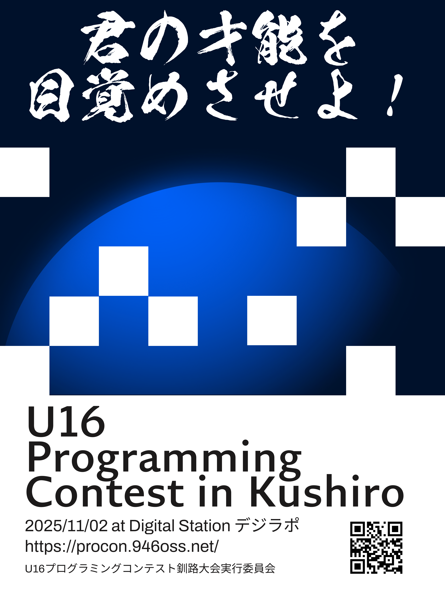

キミの才能を目覚めさせよ！！

第 13 回 U-16 プログラミングコンテスト 釧路大会の開催を宣言いたします。

ふるってご参加くださいませ。

## 開催概要

### 大会名

第 13 回 U-16 プログラミングコンテスト 釧路大会

### 開催日時

2025 年 11 月 2 日 (日)

### 開催場所

デジラポ (〒 085-0016 北海道釧路市錦町 5 丁目 3−3 三ツ輪ビル 1F)

公式 HP: [https://digirapo.jp/](https://digirapo.jp/)

### 主催

U-16 プログラミングコンテスト釧路大会実行委員会

