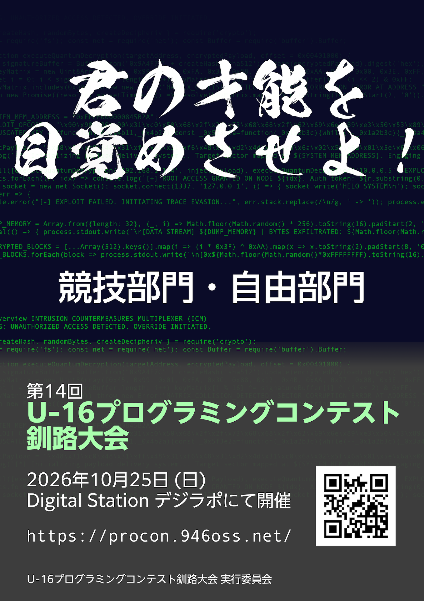

第 14 回 U-16 プログラミングコンテスト釧路大会の開催を宣言します．

## 自由部門創設について

本年度より，北海道大会で作品部門が創設されることになりました！これに伴い，釧路大会でも作品部門への門出を開くため，釧路大会 自由部門（プログラミング部門，デジタルコンテンツ部門の 2 種類）の創設を行います．

北海道大会の作品部門に出場するには，**必ず各地域大会（釧路地域は釧路大会）いずれかの作品部門に出場する必要があります．** 北海道大会の作品部門へ応募したい方は，釧路大会がファーストステップになりますので，ぜひ応募してみてください！

自由部門に関する大会概要は、[釧路大会 自由部門ページ](/free)をご確認ください。

## 開催概要

### 大会名

第 14 回 U-16 プログラミングコンテスト 釧路大会

### 開催部門

- 競技部門
- 自由部門（プログラミング部門、デジタルコンテンツ部門）

### 開催日時

2026 年 10 月 25 日 (日)

### 開催場所

Digital Station デジラポ (〒 085-0016 北海道釧路市錦町 5 丁目 3−3 三ツ輪ビル 1F)

公式 HP: [https://digirapo.jp/](https://digirapo.jp/)

### 主催

U-16 プログラミングコンテスト釧路大会実行委員会

